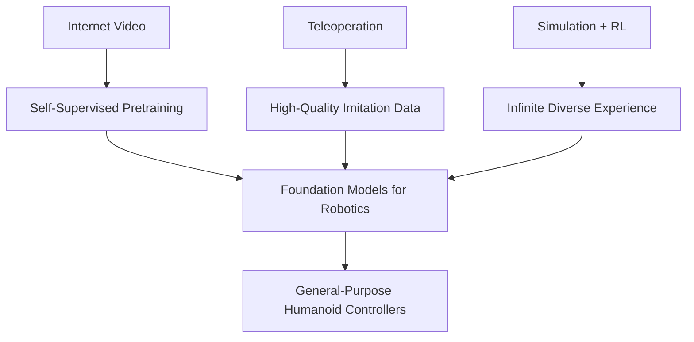

# The Three Data Engines (2023–2025)

| Engine              | Scale in 2025             | Primary Source                          | Breakthrough Paper / Dataset               |
|---------------------|---------------------------|-----------------------------------------|--------------------------------------------|
| Internet Video      | >150 million hours        | YouTube, TikTok, Instagram Reels        | Ego4D [2], Something-Something-V2 [3]      |
| Teleoperation       | >25 million trajectories  | Fleet learning (Figure, Tesla, Sanctuary)| DROID [4], Bridge Data V2 [5]              |
| Simulation          | >2 billion robot-hours    | Isaac Sim, MuJoCo, PyBullet, Isaac Lab  | Orbit [6], Isaac Gym [7] → Isaac Lab 2025  |

> "The robotics data moat is now larger than the language data moat was in 2021."  
> — Pieter Abbeel, Covariant, March 2025