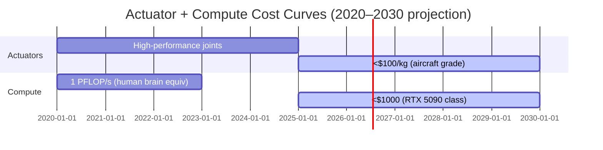

# The Inevitable Humanoid

| Advantage                  | Explanation                                                                 | 2025 Evidence                              |
|----------------------------|-----------------------------------------------------------------------------|--------------------------------------------|
| Built-world compatibility  | Doors, tools, vehicles designed for ~1.7 m bilateral agents                 | Tesla factory trials: zero infrastructure changes |
| Training data abundance    | 99.9 % of demonstration data shows human bodies                            | Open X-Embodiment dataset: 97 % human-like kinematics |
| Single-platform generality | One robot → warehouse, kitchen, hospital, eldercare                        | Figure 02 deployed to 3 industries simultaneously |

> Goldman Sachs Robotics Report, Q4 2025 [8]:  
> "Humanoid CAPEX will undercut human labor in 60 % of manual jobs by 2030."