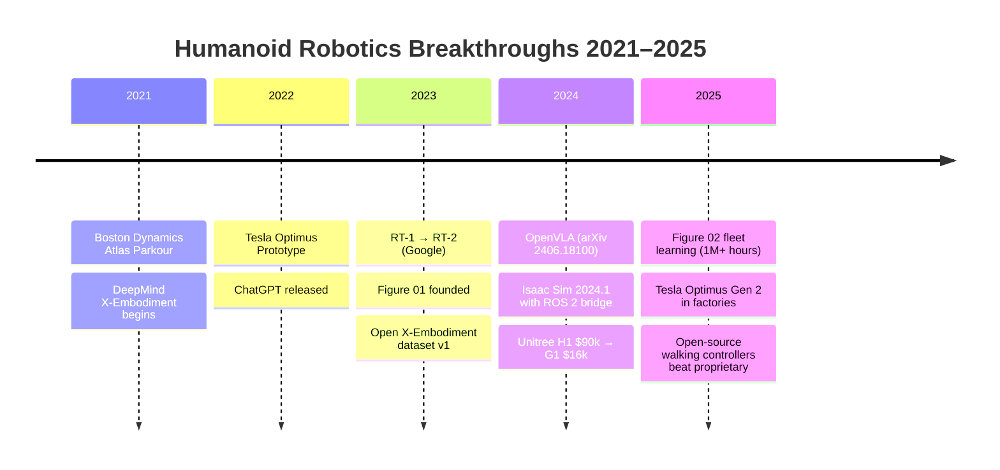

# The Inflection Years – Interactive Timeline

```mermaid
timeline
    title Humanoid Robotics Breakthroughs 2021–2025
    2021 : Boston Dynamics Atlas Parkour : DeepMind X-Embodiment begins
    2022 : Tesla Optimus Prototype : ChatGPT released
    2023 : RT-1 → RT-2 (Google) : Figure 01 founded : Open X-Embodiment dataset v1
    2024 : OpenVLA (arXiv 2406.18100) : Isaac Sim 2024.1 with ROS 2 bridge : Unitree H1 $90k → G1 $16k
    2025 : Figure 02 fleet learning (1M+ hours) : Tesla Optimus Gen 2 in factories : Open-source walking controllers beat proprietary
```