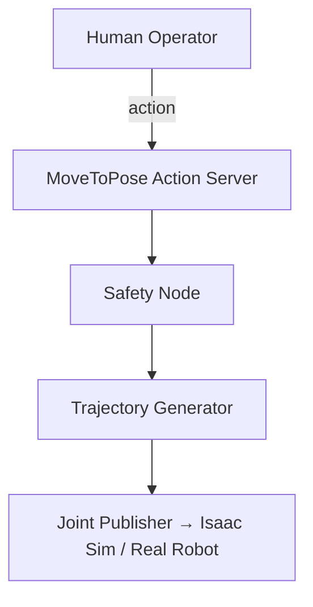

# Core Concepts (2025 Edition)

| Concept | 2025 Reality Check | Must-Know Detail |
|------------------|---------------------------------------------------|------------------|
| Nodes | One process = one responsibility | Use `managed nodes` + lifecycle |
| Topics | Fire-and-forget, zero-copy (DDS) | Use `QoS::RELIABLE` + `Depth(10)` |
| Services | Synchronous RPC | Perfect for calibration |
| Actions | Long-running goals with feedback & cancel | **The only way to move a humanoid safely** |
| Parameters | Dynamic reconfigure v2 | Declare in code → YAML override |
| Lifecycle Nodes | Explicit state machine (unconfigured → active) | Mandatory for safety-critical nodes |

