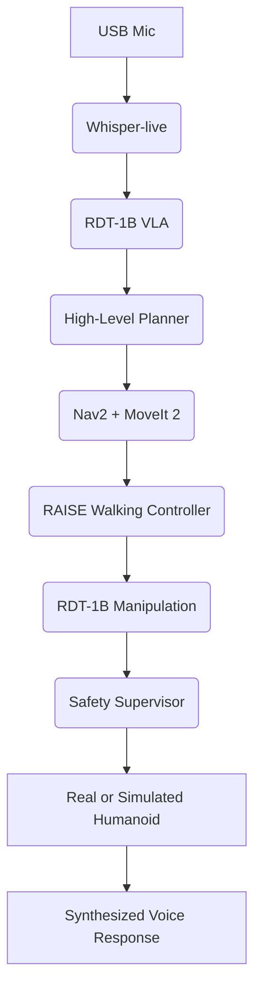

```mermaid
graph TD
    A[USB Mic] --> B(Whisper-live)
    B --> C(RDT-1B VLA)
    C --> D(High-Level Planner)
    D --> E(Nav2 + MoveIt 2)
    E --> F(RAISE Walking Controller)
    F --> G(RDT-1B Manipulation)
    G --> H(Safety Supervisor)
    H --> I[Real or Simulated Humanoid]
    I --> J[Synthesized Voice Response]
```

**All components from previous chapters. Zero new magic.**